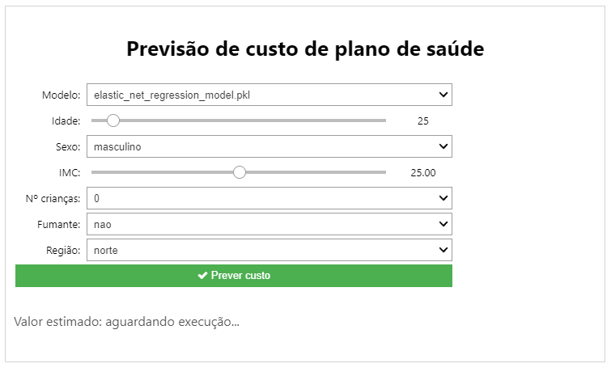

# fiap-iadev-project-fase1
Projeto destinado ao desafio da fase 1 do curso de pós graduação "AI para devs" na FIAP.

## Contexto
Dado um conjunto fictício de dados, tentar prever o valor à ser pago de plano de saúde.

## Como estar organizado
O projeto é formado pelas seguintes pastas e arquivos, com os respectivos propósitos:
> - data -> destinado à conter arquivos de dados, no caso em csv;
>> - raw.csv -> arquivo de dados base;
>> - processed.csv -> arquivo de dados pré-processados, gerado a partir do script *step_1_data_process.ipynb*;
>> - final.csv -> arquivo de dados final, gerado a partir do script *step_3_creating_model.ipynb*.
> - model -> destinado à conter modelos já gerados para facilitar uso posterior;
>> - my_model.pkl -> modelo gerado pelo script *step_3_creating_model.ipynb*.
> - src -> destinado à conter código fonte do projeto.
>> - app.py -> aplicação para poder visualizar o form de preenchimento para previsão;
>> - constants.py -> arquivo constantes;
>> - map.py -> maps para facilitar uso de categorias;
>> - save_model_manager.py -> manager para salvar e carregar modelos;
>> - step_1_data_process.ipynb -> processar os dados contido em *raw.csv*;
>> - step_2_data_analyzing.ipynb -> analisar os dados contido em *processed.csv*;
>> - step_3_creating_model.ipynb -> realizar ajustes finais e cria o modelo baseado nos dados contido em *processed.csv*.

## Screenshots

## Créditos
Copyright (C) by Deyvid Jaguaribe
