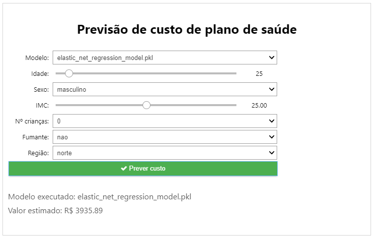

# fiap-iadev-project-fase1
Projeto destinado ao desafio da fase 1 do curso de pós graduação "AI para devs" na FIAP.

## Contexto
Dado um conjunto fictício de dados, tentar prever o valor à ser pago de plano de saúde.

## Quer ver no Google Colab?

## Rodando a aplicação
> - Basta executar todos os scripts contidos em *Passo 0: Setup*;
> - Executar a função *build_and_start_app()*.

## Como estar organizado
O projeto é formado pelas seguintes pastas e arquivos, com os respectivos propósitos:
> - main.ipynb - arquivo com todo código fonte do projeto para ser executado no Google Colab, explicação sobre as seções estão contidas nele;
> - data -> destinado à conter arquivos de dados, no caso em csv;
>> - raw.csv -> arquivo de dados base;
>> - processed.csv -> arquivo de dados pré-processados, gerado a partir dos scripts contidos no *Passo 1: Processamento dos dados*;
>> - final.csv -> arquivo de dados final, gerado a partir dos scripts contidos no *Passo 3: Construindo o modelo*.
> - model -> destinado à conter modelos já gerados para facilitar uso posterior;
>> - model_name.pkl -> modelo gerado pelos scripts contidos no *Passo 3: Construindo o modelo*.

## Screenshots

## Avaliando os modelos

### Gradient Boosting Regressor

### Linear Regression

### Lasso Regression

### Ridge Regression

### Elastic Net Regression

### Support Vector Regression

### Random Forest Regressor

## Créditos
Copyright (C) by Deyvid Jaguaribe
